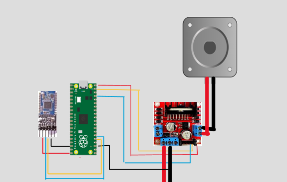

# ⚙️🦾 Resumen del proyecto 

Este programa corre en una Raspberry Pi Pico y es responsable de:

- Recibir por comunicacion serie desde un celular un enlace bluetooth
- Se envian instrucciones para manejar un motor
- Arranque
- Parada
- Sentido de giro
- Velocidad

## 🔌 Periféricos utilizados

- PWM
- MODULO BLUETOOTH (Hc O5)
- LED INDICADOR (para ARRANQUE / PARADA)
- MOTOR DC (6 VOLT)
- PUENTE H (L298n)
- FUENTE REGULADORA DE VOLTAJE 220V/12V

## 📁 Archivos importantes

- `main.c` – Lógica principal del programa
- `hardware.h` – Definiciones de pines y periféricos
- `systick.c/.h` – Temporización

## 📦 Dependencias

Este proyecto utiliza el **SDK oficial de Raspberry Pi Pico** y se construye con **CMake**.

